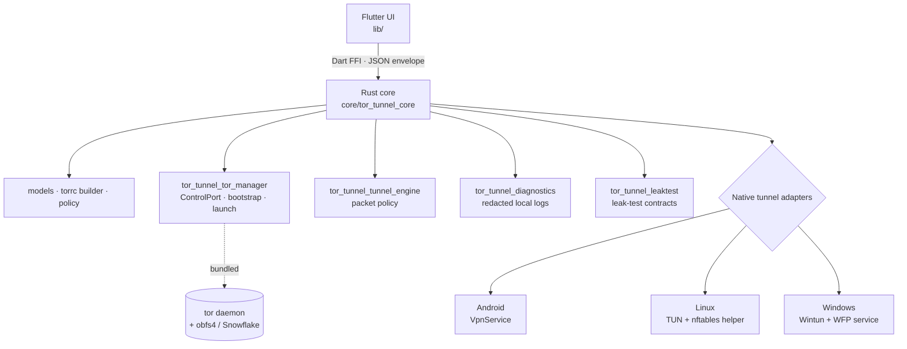

<div align="center">

# 🧅 TorTunnel

**A system-wide Tor tunnel for Android, Linux, and Windows — with strict,
fail-closed leak protection. No accounts. No backend. Local-only diagnostics.**

[](https://github.com/Elias02345/TorVPN/actions/workflows/ci.yml)
[](LICENSE)
[](#supported-platforms)
[](#project-status)
[](pubspec.yaml)
[](Cargo.toml)

</div>

---

TorTunnel routes a device's TCP and DNS through the [Tor](https://www.torproject.org/)
network with a strict kill-switch, while deliberately **blocking the traffic Tor
cannot protect** (UDP and IPv6 in the MVP). It is built for people who want Tor's
anonymity model applied system-wide — not a fast commercial VPN, and honest about
the difference.

## Why TorTunnel

- 🔒 **Fail-closed by default.** The kill-switch engages *before* Tor bootstraps
  and stays active through crashes, sleep/resume, and network changes.
- 🧅 **Real Tor, real limits.** TCP + DNS over Tor; UDP and IPv6 blocked in the
  MVP; exit countries are *preferences*, never false guarantees.
- 🕵️ **No backend, no accounts, no telemetry.** Diagnostics are local, redacted,
  and exported only when you ask.
- 🧱 **Strict Mode vs. Compatibility Mode.** App exceptions are forbidden in
  Strict Mode and only ever exist as clearly-labeled reduced protection.
- 🦀 **Rust core, Flutter UI.** A small, testable Rust core owns policy and Tor
  orchestration; the Flutter app is a thin, honest front-end over a versioned C ABI.

## Project status

> [!IMPORTANT]
> **TorTunnel is an alpha, not yet a production VPN.** The Flutter UI and Rust
> core are functional and fully tested, the FFI bridge works, and the headless
> `tortunnel up` launches a real tor process with a working SOCKS proxy
> (CI-verified). The privileged, system-wide **native tunnel adapters are now
> implemented (Linux helper, Android `VpnService`, Windows service) but have
> not been leak-verified on real devices**, so Strict Mode never reports
> `protected`. Do not rely on this build for real anonymity until the
> [verification checklist](docs/VERIFICATION_CHECKLIST.md) passes, the
> [stable blockers](docs/audit/STABLE_BLOCKERS.md) are closed, and an external
> audit is complete.

| Component | State |
| --- | --- |
| Flutter UI (`lib/`) | ✅ Functional, analyzed, tested |
| Rust core + FFI (`core/`) | ✅ Functional, unit-tested, CI-green |
| Tor engine (`tortunnel up`) | ✅ Launches real tor + working SOCKS proxy (CI-verified) |
| Native tunnel adapters | 🚧 Implemented (Linux helper, Android VpnService, Windows service) — **not yet leak-verified** |
| Device leak tests · code signing · audit | ⛔ Required for stable; human-gated ([checklist](docs/VERIFICATION_CHECKLIST.md)) |

## Architecture



The UI talks to the core through `CoreClient`, implemented by either
`MockCoreClient` (pure-Dart development core) or `FfiCoreClient` (the real Rust
core). Every FFI call exchanges a JSON `FfiEnvelope { protocol_version, ok,
payload, error }`. See [`docs/ARCHITECTURE.md`](docs/ARCHITECTURE.md).

## Strict Mode policy

| Traffic | Strict Mode |
| --- | --- |
| TCP | Routed through Tor |
| DNS | Resolved through Tor |
| UDP | **Blocked** (MVP) |
| IPv6 | **Blocked** (MVP) |
| Exit country | Preference with transparent fallback — not a guarantee |
| App exceptions | **Forbidden** (Compatibility Mode only, reduced protection) |
| P2P / torrenting | Warned against; not a supported use case |

## Supported platforms

| Platform | Tunnel technology | Privileged component |
| --- | --- | --- |
| **Android** | `VpnService` packet loop | Foreground VPN service |
| **Linux** | TUN + `nftables` default-deny | systemd/polkit helper |
| **Windows** | Wintun + Windows Filtering Platform | Signed Windows service |

## Quickstart

```bash
flutter pub get
flutter analyze
flutter test

cargo fmt --check
cargo clippy --workspace --all-targets -- -D warnings
cargo test --workspace
cargo deny check
```

### Building on Windows

The MSVC toolchain needs the **Windows SDK** in `LIB` and the MSVC `link.exe`
ahead of Git's `usr/bin/link.exe`. A plain shell has neither, so run Cargo
through the bundled wrapper:

```powershell
tools/dev-cargo.ps1 test --workspace
tools/dev-cargo.ps1 fmt --check
# Quote the `--` so PowerShell forwards it to clippy instead of consuming it:
tools/dev-cargo.ps1 clippy --workspace --all-targets '--' -D warnings
```

Install the Windows SDK once if it is missing:

```powershell
& "${env:ProgramFiles(x86)}\Microsoft Visual Studio\Installer\setup.exe" modify `
  --installPath "C:\Program Files\Microsoft Visual Studio\2022\Community" `
  --add Microsoft.VisualStudio.Component.Windows11SDK.22621 --quiet --norestart
```

## Repository layout

```text
lib/                     Flutter UI + CoreClient (Mock / FFI)
core/tor_tunnel_core/    Rust domain core, torrc builder, C ABI (FFI)
core/tor_tunnel_*/       Tor manager, tunnel engine, platform contracts, diagnostics, leak tests
android/ linux/ windows/ Flutter runners + native adapter scaffolds
packaging/               Flatpak, AppImage, DEB/RPM, MSI release contracts
docs/                    Architecture, threat model, platform adapters, leak-test matrix
tools/                   dev-cargo.ps1 (Windows build), release-gate.ps1
```

## Roadmap

1. **Foundation** — green build, real Rust core wired to the UI over FFI. ✅
2. **Tor runtime** — bundled `tor` daemon + `tun2proxy`, ControlPort, pluggable
   transports (obfs4 / Snowflake). 🚧
3. **Native adapters** — Android `VpnService`, Linux nftables helper, Windows
   Wintun/WFP service, with kill-switch and DNS-over-Tor.
4. **Hardening** — device leak tests, reproducible Tor builds, artifact signing,
   external security audit.

## Security & privacy

TorTunnel makes explicit, testable promises — see
[`docs/THREAT_MODEL.md`](docs/THREAT_MODEL.md), [`SECURITY.md`](SECURITY.md), and
the [leak-test matrix](docs/LEAK_TEST_MATRIX.md). Report vulnerabilities through
the repository security advisory flow. Never commit signing keys or unredacted
logs.

## Contributing

Contributions that preserve the privacy model are welcome. Please read
[`CONTRIBUTING.md`](CONTRIBUTING.md) and the
[Code of Conduct](CODE_OF_CONDUCT.md), and run the checks above before opening a
pull request.

## License

TorTunnel is licensed under **GPL-2.0-or-later**. See [LICENSE](LICENSE).
